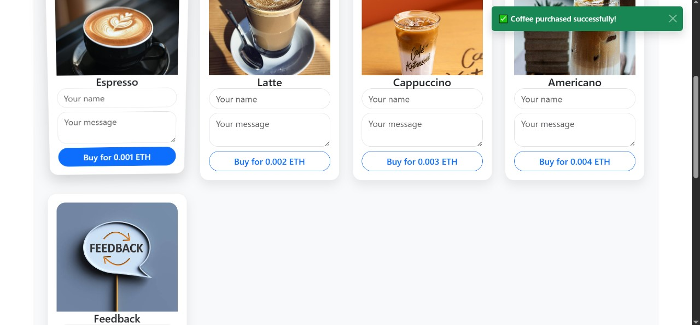

☕ Buy Me a Crypto Coffee – Web3 DApp
A decentralized application where users can support you by sending small Ethereum donations along with a personal message — like buying you a coffee!

🚀 Features
💸 Send ETH-based coffee donations

✍️ Leave a name and custom message

🧾 All coffees (transactions) are recorded on-chain

✅ MetaMask wallet connection

🎁 Special “free feedback” card (no ETH required)

🧠 Withdraw all collected funds (owner-only)

🎨 Beautiful and responsive UI (Bootstrap + AOS)

🔧 Tech Stack
Smart Contract: Solidity (deployed locally via Hardhat)

Frontend: React.js + Bootstrap

Blockchain Interaction: ethers.js

Wallet Integration: MetaMask

Animations: AOS.js

Local Blockchain: Hardhat (localhost network)

## 📸 Screenshots

### 🏠 Home Page

### 🔐 Wallet Connected

### ☕ Coffee Menu

### 📜 Coffee List

### ❌ Transaction Failed

### ✅ Transaction Success

🛠️ Setup Instructions
1. Install Dependencies
bash
Copy
Edit
npm install
2. Compile & Deploy Smart Contract
bash
Copy
Edit
npx hardhat node
Open a new terminal:

bash
Copy
Edit
npx hardhat run scripts/deploy.js --network localhost
Then, copy the deployed contract address and update:

utils/contractAddress.js

Confirm your ABI in utils/contractABI.json

3. Run the React App
bash
Copy
Edit
npm start
Make sure MetaMask is connected to http://localhost:8545 and using one of Hardhat's accounts.

🔐 Withdraw Page
Accessible only by the contract owner to withdraw funds.

Password-protected page: /withdraw

📜 License
MIT License © 2025
